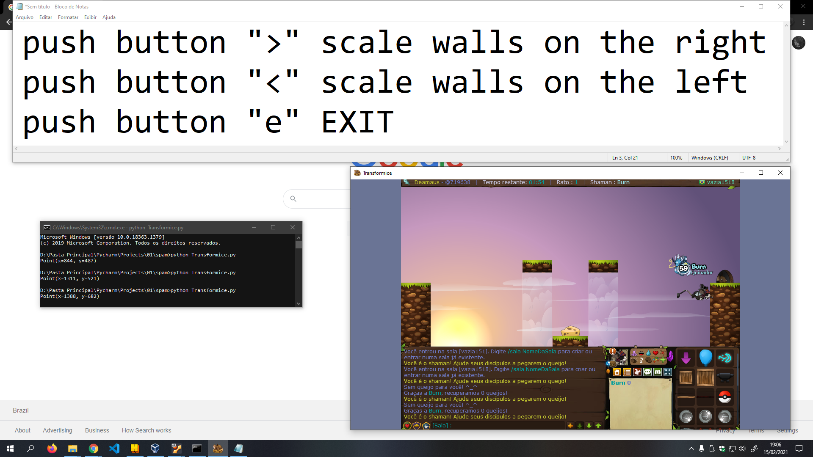

# Jump Auto: Transformice

#### This is a script that makes the transformice mouse automatically climb walls

## Language
 
<code></code>

 

## Preview

### Installation

git clone https://github.com/LuciLua/JumpAuto

#### How to use

python  transformice.py

 

push button ">" scale walls on the right

 

push button "<" scale walls on the left

 

push button "e" EXIT

 
